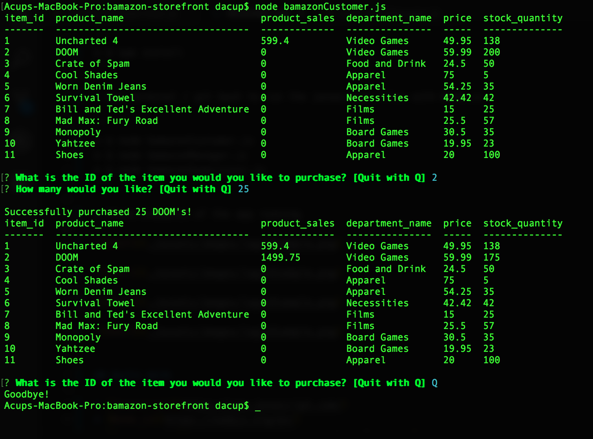
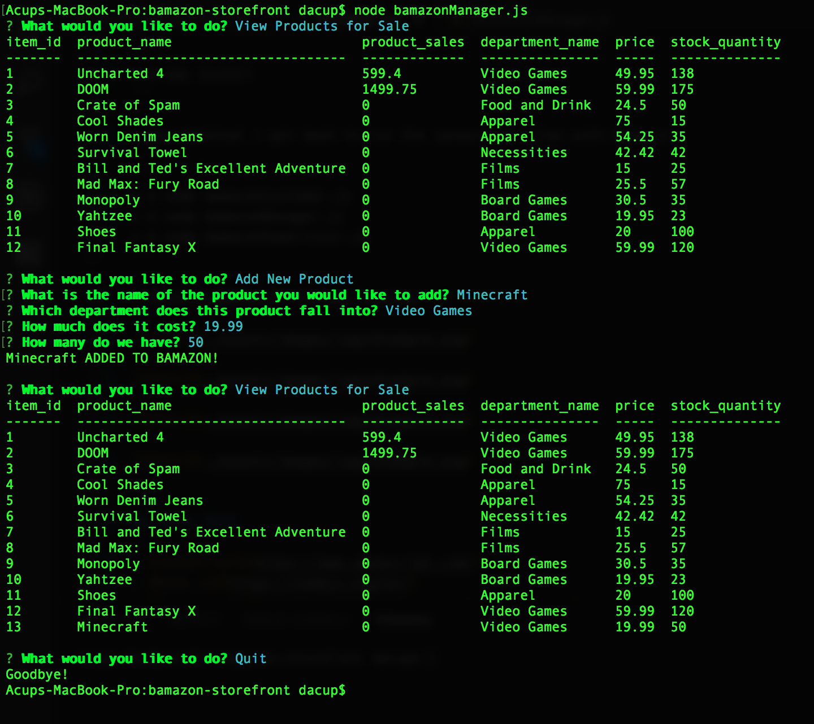
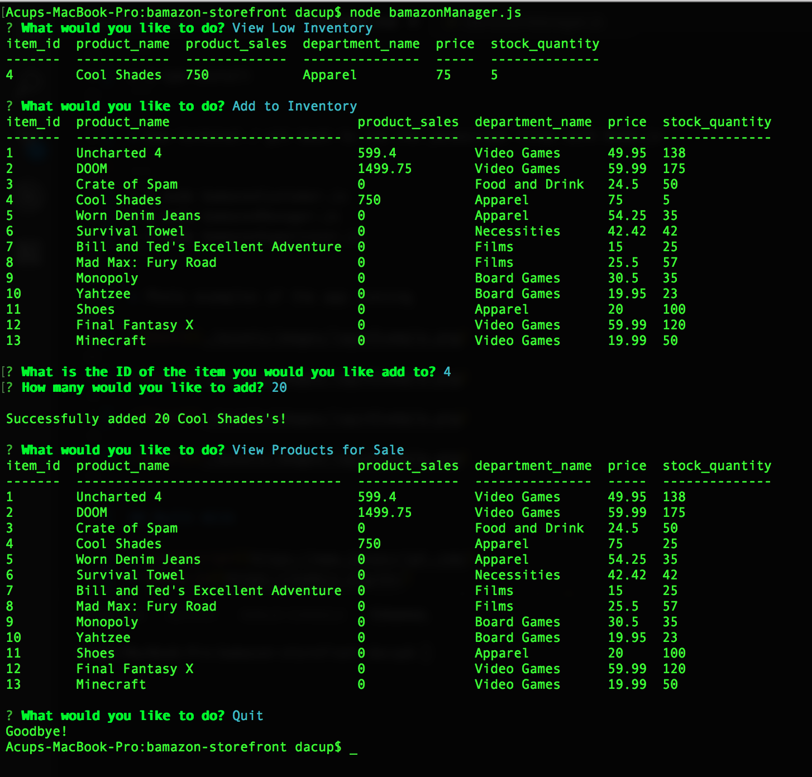
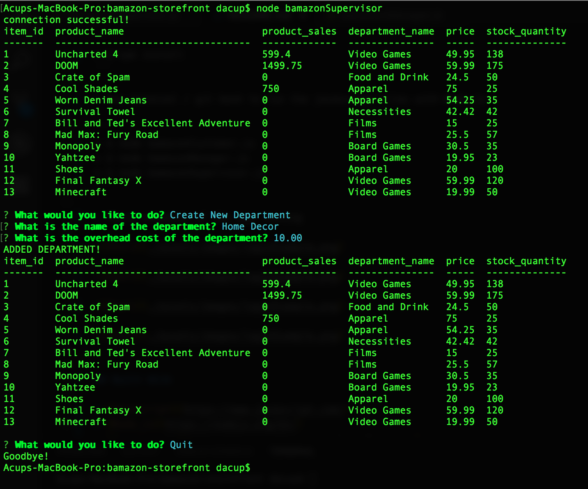
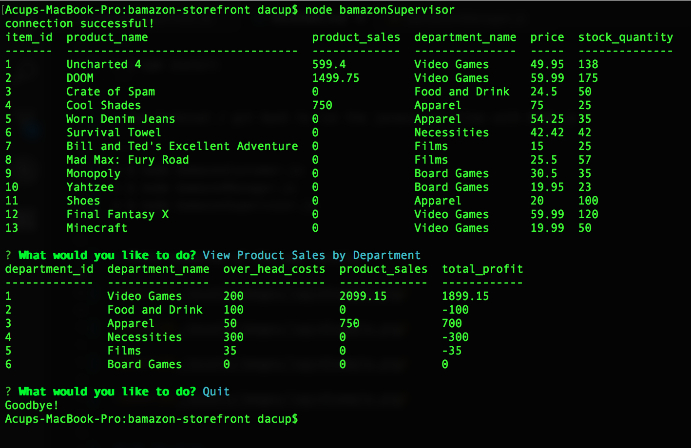

# Bamazon Storefront

Bamazon is a [Node.js](https://nodejs.org/en/) app the runs through the console and allows for a multi layered store environment to function with mySQL database.  At the customer level users are prompted on the console with [Inquirer.js](https://www.npmjs.com/package/inquirer) to buy products.  On the manager level users are prompted to add inventory and products along with other useful tasks.  On the Supervisor level users can veiw total sales and add product departments.

## Getting Started

These instructions will get you a copy of the project up and running on your local machine for development purposes.

### Prerequisites

What things you need to install the software and how to install them

```
* [Javascript](https://www.javascript.com/)
* [Node.js](https://nodejs.org/en/)
* [SQL](https://www.w3schools.com/sql/)
* [MySQL Workbench](https://www.mysql.com/products/workbench/)
* [MAMP](https://www.mamp.info/en/)
* Terminal (Mac) / Git Bash (PC)
```

### Installing

A step by step series of examples that tell you how to get a development env running

* Install the prerequisites on your computer

```
* Javascript
* Node.js
* SQL
* MySQL Workbench
* MAMP
* Terminal (Mac) / Git Bash (PC)
```

* Set up localhost SQL server with MySQL Workbench and MAMP

```
* SQL
* MySQL Workbench
* MAMP
```

* Run schema.sql in MySQL Workbench to set up local database and table with seeded information

```
* schema.sql file
* MySQL Workbench
```

* Use terminal / git bash to run npm install for required npm packages (inquirer, mysql, console.table)

```
* $ npm install
```

* Use terminal / git bash to run the javascript files with Node.js

```
* $ node bamazonCustomer.js
* $ node bamazonManager.js
* $ node bamazonSupervisor.js
```

## Photo examples of the app running

* Customer purchasing product



* Manager adding new product



* Manager adding more inventory to existing product



* Supervisor checking sales by department



* Supervisor adding new department




## Built With

* [Javascript](https://www.javascript.com/)
* [Node.js](https://nodejs.org/en/)
* [Inquirer.js](https://www.npmjs.com/package/inquirer)
* [SQL](https://www.w3schools.com/sql/)

## Code Editor: 

* [Visual Studio Code](https://code.visualstudio.com/)

## Authors 

* **Dylan Acup** - [Portfolio](https://dacup72.github.io/Dylan-Acup-Portfolio/)

